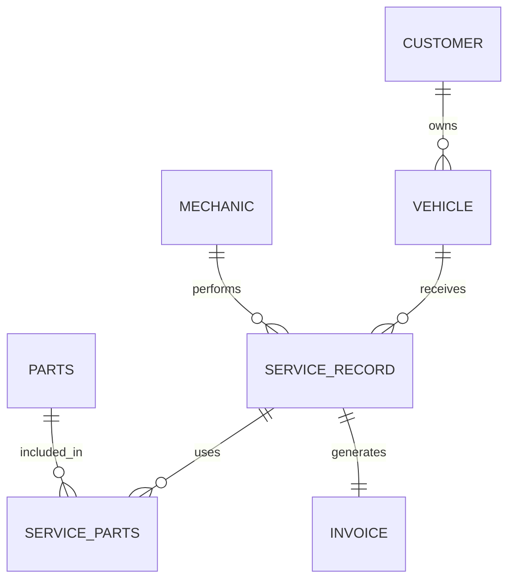

# Vehicle Service Management System — DBMS Report

## 1. Problem Definition
A database-driven system to manage customers, vehicles, service jobs, mechanics, parts used in jobs and invoices.

## 2. ER Model

## 3. Relations and 3NF
- Customer(customer_id, name, phone, email, address)
- Vehicle(vehicle_id, customer_id, registration_no, make, model, manufacturing_year)
- Mechanic(mechanic_id, name, phone, specialization)
- ServiceRecord(service_id, vehicle_id, mechanic_id, service_date, service_type, description, labor_cost, status)
- Parts(part_id, part_name, quantity_in_stock, unit_price)
- ServiceParts(service_id, part_id, quantity, unit_price)
- Invoice(invoice_id, service_id, invoice_date, parts_amount, labor_amount, tax_amount, total_amount, payment_status)

The schema separates independent entities, removes repeating groups, uses a junction table for the M:N ServiceRecord-Parts relationship, and makes every non-key attribute depend on the key of its relation.

## 4. Physical View
- Storage engine: InnoDB.
- Primary keys create clustered primary indexes in InnoDB.
- Foreign-key columns are indexed explicitly where useful.
- Service date, part name and invoice date have secondary indexes for common lookups.
- No partitioning is necessary for the small college-project dataset; partitioning would add complexity without a meaningful benefit at this scale.

## 5. SQL Generation
The application constructs SQL strings in `backend/query_engine/` and passes values separately to `mysql-connector-python`. No ORM is used.

## 6. Viva Points
- Why ServiceParts? It resolves the M:N relationship.
- Why composite PK in ServiceParts? A service-part pair should occur once.
- Why InnoDB? Transactions, foreign keys and crash recovery.
- Why parameterized values? Prevent SQL injection and keep data separate from SQL syntax.
- Why no partitioning? Dataset is small; partitioning is justified only when data volume/access patterns warrant it.
